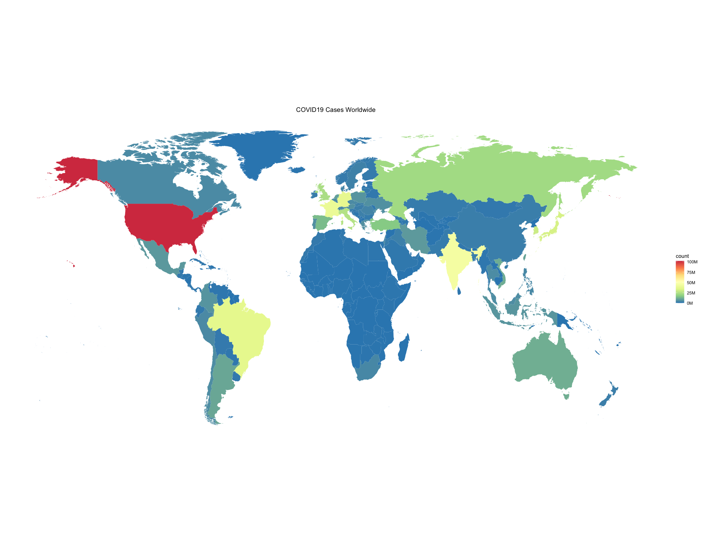
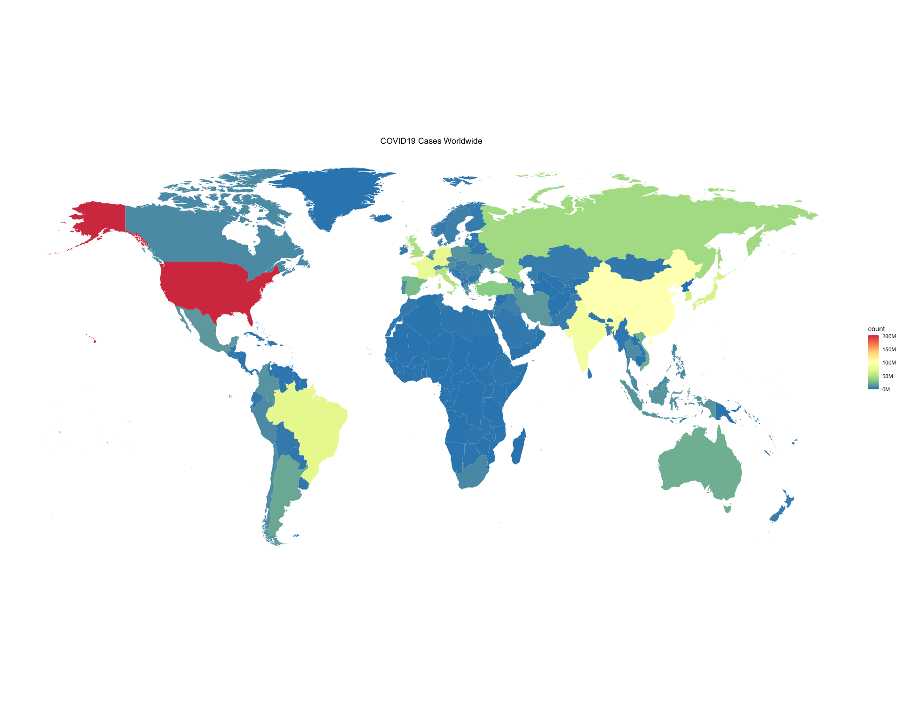

# COVID 19 Visualization Mini Project

GitHub Pages: <https://tanvihsibal.github.io/covid-19-visualization/>

School: University of the Cumberlands

Degree: Master of Science in Information Technology

Subject: ITS-530 - Analyzing & Visualizing Data

Term: 2023 Sprint - First Bi-term

COVID-19 Datasets:

1.  [From OurWorldInData.org](https://covid.ourworldindata.org/data/owid-covid-data.csv)

2.  [From covid19.who.int](https://covid19.who.int/WHO-COVID-19-global-data.csv)

R packages:

``` r
install.packages("tidyverse")
install.packages("ggplot2")
install.packages("ggmap")
```

Outputs:

-   With just OWID data 
-   With OWID & WHO data 

Here are the two noticeable differences:

1.  The scale in the legend of the second plot is doubled.\
    This difference is expected as the WHO data we used was almost the same size as the OWID data. So, upon combining, all numbers are expected to double.

2.  Numbers in China vary by a lot.\
    This discrepancy is probably because of the fact that OWID data categorizes only Mainline China as "China", while it's not the case with WHO data. WHO data includes numbers from Taiwan, Hong Kong, and other areas too which are not categorized under the term "Mainland China.
